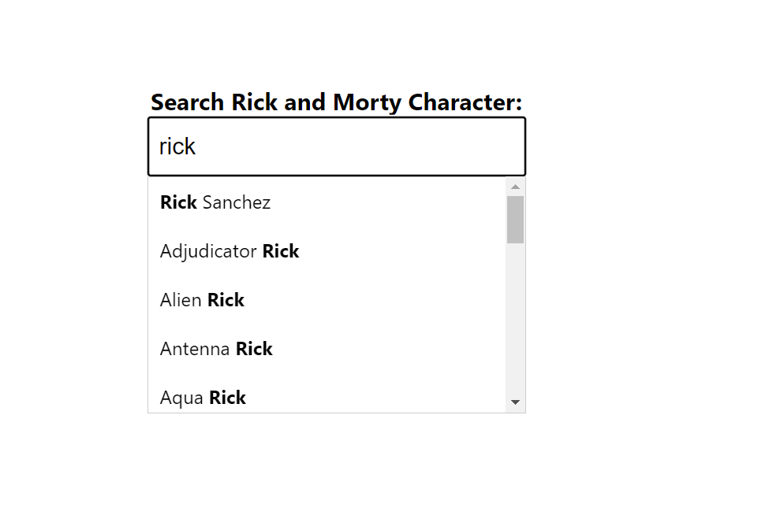

# Autocomplete Input for Rick And Morty Character names

You can type con the search input a character name and you will see the results found

## Available Scripts

In the project directory, you can run:

### `npm install`
To install all dependencies needed

### `npm start`

Runs the app in the development mode.\
Open [http://localhost:3000](http://localhost:3000) to view it in the browser.

